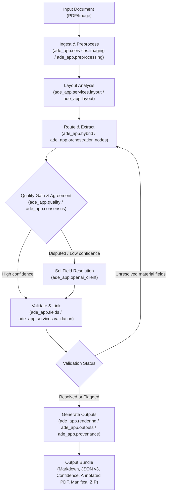

# Architecture

This document describes the request and data flow, primary state types, and external system boundaries of the ADE (Agentic Document Extraction) codebase.

## System flow

The extraction pipeline processes documents through a multi-stage workflow defined by an in-memory LangGraph state machine in `ade_app.orchestration.graph` and executed across components in `ade_app`.

### Execution stages

1. **Ingest and preprocess** (`ade_app.preprocessing.ingest_document`, `ade_app.raster`):
   Loads PDF or image bytes into memory. PyMuPDF renders PDF pages to PNG at the target DPI (default 300 DPI, capped by raster pixel limits). OpenCV assesses page rotation, deskew angle, and contrast, producing a `PreparedPage` and reversible `PageTransform`.
2. **Layout analysis** (`ade_app.layout.PPStructureAnalyzer`):
   Runs PP-StructureV3 on the prepared page to identify text, table, and form regions, producing `LayoutAnalysis` with bounding boxes. In case of accelerator failure, it falls back to CPU if permitted by configuration.
3. **Route and extract** (`ade_app.hybrid.HybridPageExtractor`, `ade_app.openai_client`):
   Dispatches page images concurrently using `ade_app.orchestration.run_page_workflow`. Sends primary extraction requests to OpenAI `gpt-5.6-luna` using structured output (`src/ade_app/prompts/page_extraction.md`).
4. **Quality verification and consensus** (`ade_app.quality`, `ade_app.consensus`):
   Segments below the quality threshold or layout confidence threshold are cropped and routed to `gpt-5.6-terra` (`src/ade_app/prompts/segment_consensus.md`) for independent verification.
5. **Dispute resolution and repair** (`ade_app.openai_client.resolve_field`):
   Disagreements between primary and verification extractions are routed to `gpt-5.6-sol` (`src/ade_app/prompts/field_resolution.md`) for targeted field repair.
6. **Validate and link** (`ade_app.fields.link_and_validate_fields`):
   Constructs `ExtractedFieldV3` records, links evidence, evaluates validation checks, and calculates confidence. If material fields require Sol escalation and retries remain, the graph loops back via `sol_retry`.
7. **Generate outputs** (`ade_app.rendering`, `ade_app.outputs`, `ade_app.provenance`):
   Renders deterministic Markdown with `<!-- PAGE BREAK -->` dividers, serializes schema-validated v3 JSON, generates a confidence report, creates an annotated PDF with color-coded bounding boxes and review sidebar, calculates SHA-256 digests, and packages artifacts into a ZIP archive with a v9 manifest.

## Main types and state

The primary data structures and where they live in the codebase:

| Type | Module | Purpose |
| --- | --- | --- |
| `DocumentWorkflowState` | `ade_app.orchestration.state` | State object for the LangGraph document extraction graph. |
| `PageState` | `ade_app.orchestration.state` | State object for concurrent page fan-out. |
| `WorkflowRequest` | `ade_app.orchestration.state` | Encapsulates the source document, page selection, DPI, and optional progress callback. |
| `ExtractionRun` | `ade_app.contracts` | The final extraction outcome containing all artifact texts, bytes, filenames, tokens, cost, and manifest. |
| `PageRunRecord` | `ade_app.contracts` | Per-page operational metrics including tokens, model attempts, timing, segments, and failure status. |
| `DocumentInput` | `ade_app.inputs` | Immutable container for an input file's name and raw bytes. |
| `RenderedPage` | `ade_app.raster` | In-memory rasterized page containing raw PNG bytes, dimensions, and effective DPI. |
| `PreparedPage` | `ade_app.preprocessing` | Rasterized page paired with applied preprocessing transforms and bounding box converters. |
| `PageTransform` | `ade_app.preprocessing` | Mathematical metadata for forward and inverse coordinate transforms (rotation, deskew, margins). |
| `LayoutAnalysis` | `ade_app.layout` | Regions detected by PP-StructureV3 with classification and bounding boxes. |
| `ExtractionDocumentV3` | `ade_app.models` | Strict output schema for v3 extraction JSON with nullable unresolved values and structured metadata. |
| `ExtractedFieldV3` | `ade_app.models` | Individual extracted field containing evidence provenance, status, validation checks, and routing scores. |
| `GroundTruthDocument` | `ade_app.models` | Base schema matching local GroundTruth JSON structure. |
| `PipelineConfig` | `ade_app.config` | Strict configuration hierarchy covering models, imaging, layout, routing, retries, runtime, and logging. |
| `TokenUsage` | `ade_app.cost` | Input, output, cached, and reasoning token counters used for cost accounting. |
| `BatchDocument` | `ade_app.batch` | Single document item within a multi-document batch request. |

## External systems

The codebase interacts with the following external systems:

1. **OpenAI API**:
   - Host: `https://api.openai.com/v1` (or an official OpenAI HTTPS endpoint specified by `OPENAI_BASE_URL`).
   - Models:
     - `gpt-5.6-luna`: Primary extraction at `low` reasoning effort.
     - `gpt-5.6-terra`: Independent segment verification at `medium` reasoning effort.
     - `gpt-5.6-sol`: Targeted dispute resolution and field repair at `low` reasoning effort.
   - Mechanism: Official `openai.OpenAI` SDK (`responses` interface) with `store=False`.
2. **Paddle / PP-StructureV3**:
   - Engine: Local PP-StructureV3 layout analysis model loaded via `paddleocr` and `paddlex`.
   - Execution: Runs locally on the host machine using either NVIDIA GPU (via `paddlepaddle-gpu`) or CPU (via `paddlepaddle`).
   - Network activity: Disabled at runtime by setting `PADDLE_PDX_DISABLE_MODEL_SOURCE_CHECK="True"`.
3. **Local filesystem and network interfaces**:
   - Web server: Streamlit server binds locally to `127.0.0.1:9674` with XSRF protection. It does not accept remote network connections.
   - Storage: In-memory during pipeline execution. Files are written to disk only when saving via the CLI (`--output-dir`), downloading via Streamlit, or generating evaluation reports.
