# Architecture and extraction walkthrough

GPT-6 Sol with medium reasoning returns semantic page data. Local code validates, routes,
renders, annotates, accounts for, and packages it.

Default routing uses full-page extraction. Verification and repair are independent opt-in stages,
and both start off. Primary results are saved as unverified draft MD/JSON. The verified v3
renderer redacts unresolved values. Advanced local or regional routing needs explicit
configuration and compatible calibration evidence.

```mermaid
flowchart LR
    U[Authorized uploads] --> B[Validated BatchDocument tuple]
    B --> R[PyMuPDF 300 DPI pages]
    R --> P[Conditional OpenCV preprocessing]
    P --> L[PP-StructureV3 + form geometry]
    L -->|calibrated printed regions| D
    L -->|ambiguous or uncalibrated| G[LangGraph page fan-out]
    G --> N[primary structured extraction]
    N --> Q[Validation and quality evidence]
    Q -->|accepted| D[Deterministic renderer]
    Q -->|verification enabled| I[Independent GPT-6 Sol crop]
    I -->|agreement| D
    I -->|repair enabled and disagreement| S[GPT-6 Sol field-resolution crop]
    Q -->|repair enabled without verification| S
    Q -->|unverified| H
    N --> T[Unverified draft MD and JSON]
    I -->|uncertain or conflict| H[needs_review]
    S -->|resolved| D
    S -->|unresolved| H
    H --> D
    D --> O[JSON, Markdown, confidence JSON, annotated PDF and ZIP]
```



## Component boundaries

| Area | Modules | Owned responsibility |
|---|---|---|
| UI/session | `streamlit_app.py`, `session.py` | Authorization, uploads, page controls, progress, reset, previews, downloads |
| Batch scheduling | `batch.py` | File/page/byte/pixel limits, four-document pool, failure isolation |
| Workflow | `orchestration/` | In-memory LangGraph page fan-out, source-order merge, no PHI checkpoint |
| Input imaging | `inputs.py`, `raster.py`, `preprocessing.py` | Filename/content checks, 300 DPI rasterization, conditional reversible cleanup |
| Layout/routing | `layout.py`, `hybrid.py` | PP-StructureV3 regions, form geometry proposals, calibrated fail-closed routing |
| Model access | `openai_client.py`, `prompts/*.md` | Responses API calls, structured parsing, request metadata, staged routing |
| Quality evidence | `quality.py`, `consensus.py`, `verification.py` | Calibrated signals, peer evidence, field comparison, non-correcting format checks |
| Output contract | `models.py`, `schemas/`, `services/confidence.py`, `outputs.py` | Strict schemas, deterministic Markdown/ranges/IDs, confidence, annotations, archives |
| Measurement | `corpus.py`, `profile.py`, `calibration.py`, `evaluation.py` | Exact-stem mapping, profile discovery, calibration, GroundTruth metrics |

## End-to-end walkthrough

### 1. Uploads become validated document inputs

`streamlit_app.py` renders the authorization checkbox, multi-file uploader, and per-file
inclusive start/end page controls. Each `UploadedFile` becomes a `DocumentInput`;
`DocumentInput` in `inputs.py` rejects unsafe names, unsupported suffixes, empty content, and
files over 200 MB.

```text
UploadedFile → DocumentInput(filename, data) → _UploadItem(item_id, source, page_count)
```

Branches:

- Invalid bytes or filenames produce a per-file UI error.
- Reordered or changed uploads clear only ADE-owned page/result state.
- Extraction remains disabled until authorization is acknowledged and page ranges are valid.

### 2. Page ranges become a bounded batch

On submit, the UI converts each start/end pair through `parse_page_range` and creates a tuple of
`BatchDocument` values. `extract_documents` in `batch.py` rejects empty batches, more than 20
files, duplicate item IDs, more than 500 MB, more than 100 selected pages, invalid ordering, and
excess estimated raster pixels.

```text
_UploadItem + (start, end) → BatchDocument(item_id, DocumentInput, pages)
```

### 3. Selected pages are rasterized and scheduled

`rasterize_document` in `raster.py` decodes only selected pages and yields normalized PNG-backed
`RenderedPage` records. The pool in `batch.py` admits at most four documents and assigns up to
two primary page workers to each document. Those potential workers share the process-wide
Responses semaphore in `openai_client.py`, which admits at most four API calls. The 20-file value
is therefore an upload limit, not API concurrency.

```text
DocumentInput + pages → tuple[RenderedPage(source_page, png_bytes, width, height), ...]
```

### 4. Local analysis routes primary semantic extraction

PP-Structure layout input is capped at 1,600 pixels on its longest side. Coordinate transforms
map its regions back to the configured full-resolution page used for model verification.

`extract_document` in `pipeline.py` detects the staged extractor and runs `extract_primary`.
`OpenAIPageExtractor` submits the page image to the Responses API with
`AuditedSemanticPageExtraction` as its structured format and `store=False`. Local code rejects
missing parsed output, empty extraction on a visibly nonblank page, invalid audits, and invalid
rendered ranges.

```text
RenderedPage → AuditedSemanticPageExtraction(children, audits)
             → PageExtraction(markdown, grounded children)
```

Failure branch: a page-level provider, runtime, or validation failure becomes a failed
`PageOutcome` and `PageRunRecord`; it does not discard successful sibling pages.

### 5. Low-quality segments may need another read

`OpenAIPageExtractor.finalize` records each primary segment's score, reasons, and attempts.
An uncalibrated score alone cannot accept a segment. With verification off, the segment remains
unverified. With verification on, ADE can read an independent crop. The escalation limit bounds
these reads. Excess segments receive `repair_budget_exhausted` and need review:

1. An independent GPT-6 Sol request sees the original crop, not the primary transcription.
2. Document-local peer evidence may accompany that crop when a clearer stable repeated region
   exists; `consensus.py` owns peer comparison.
3. Field-level agreement preserves the candidate. With repair enabled, disagreements send
   disputed crops and structural IDs to GPT-6 Sol with parent context but no candidate answers.
   Repair can also reread flagged fields without segment verification.
4. Unresolved fields, structural conflicts, failed calls, and exhausted repair budget remain
   `needs_review` rather than receiving fabricated content.

```text
segment + audit → SegmentQuality
crop → SemanticSegmentPatch
two semantic elements → Comparison
disputed fields → SemanticFieldResolutionBatch
result → SegmentRecord(status, score, reasons, attempts)
```

### 6. Local code creates artifacts

`render_semantic_page` in `rendering.py` converts semantic lines, styles, checkboxes, figures,
and table cells into deterministic Markdown and local ranges. `render_document` restores
requested page order, rebases ranges, assigns IDs, records failed pages, and constructs a
validated `GroundTruthDocument`, then deterministically links generic fields and NPI/Member ID
checks into `ExtractionDocumentV3`. The pipeline serializes and validates that document again
before returning it.

```text
list[PageOutcome] → GroundTruthDocument → ExtractionDocumentV3(fields + evidence) → JSON text
```

### 7. Review and download artifacts are assembled

The pipeline overlays trusted element boxes on the exact selected page images, records omitted
or uncertain annotations, and adds provenance, prompt hashes, token usage, model-specific cost,
and review state to the manifest. `outputs.py` builds the annotated PDF and exact
individual/batch ZIP contents. The UI previews Markdown, JSON, and PDF and exposes independent
downloads.

## Ordering and concurrency facts

- Upload limit: 20 files (`MAX_BATCH_FILES` in `batch.py`).
- Active document workers: at most 4 (`MAX_FILE_WORKERS` in `batch.py`).
- Primary page workers per document in the Streamlit batch path: at most 2
  (`MAX_PAGE_WORKERS_PER_DOCUMENT` in `batch.py`).
- Maximum concurrent API calls across the process: 4 (`MAX_CONCURRENT_RESPONSES` in
  `openai_client.py`).
- Completion events may arrive out of order; `pipeline.py` rebuilds records using the requested
  page tuple, and `batch.py` rebuilds files using upload order.

The standalone `extract_document` function defaults to three page workers. Evaluation reads
`runtime.max_page_workers`, which defaults to three. These differ from the Streamlit batch limit.

## Side effects and trust boundaries

- **External network:** selected images and repair crops are sent only through the configured
  official OpenAI Responses endpoint. Requests specify `store=False`.
- **Memory:** upload bytes, rasters, semantic results, PDFs, and ZIPs live in process/session
  memory during the UI workflow.
- **Filesystem:** the UI does not automatically persist document artifacts. Browser downloads
  write only where the operator chooses. Profiling and calibration write their requested
  profile/report files; evaluation creates a new run directory and writes generated artifacts.
- **Database/queue:** none exists in this repository.
- **Credentials:** read from `OPENAI_API_KEY` or Streamlit secrets and excluded from artifacts.
- **Reset:** `reset_session_state` removes only known ADE session keys; it performs no filesystem
  deletion.

## Verification checkpoints

1. **Input boundary:** invalid name/type/size/page range fails before a model call.
2. **Concurrency:** 20 uploads and the nested worker pools still produce no more than four
   simultaneous Responses API calls.
3. **Structured output:** every successful page validates before document assembly.
4. **Partial failure:** one failed page remains visible while successful pages are downloadable.
5. **Review state:** unresolved segments appear in the manifest and annotation limitations.
6. **Output identity:** manifest hashes match generated Markdown, JSON, and annotated PDF.
7. **Evaluation:** measured accuracy comes only from mapped source/GT pairs and a credentialed run.
